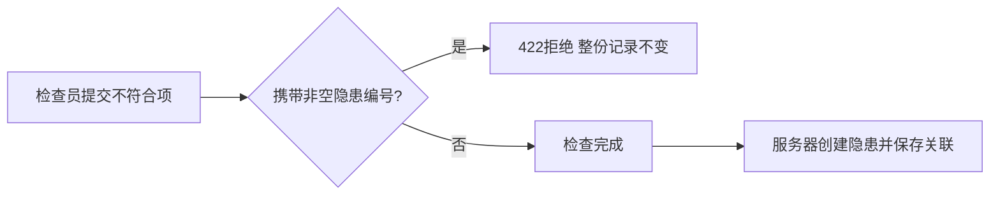

# 安全检查转隐患：服务器管理关联编号

## 业务问题

锅炉辅机检查发现“联轴器防护罩缺损”，检查员提交不符合项后应能生成一张可追溯的隐患单。旧接口把提交项与返回项共用一个类型，允许客户端直接写入 `hazard_id`。

实际复现：提交 `hazard_id=999999` 返回200并保存，后续转隐患返回400“已转隐患单”，数据库却没有相应隐患。这会让检查记录显示的关联与真实整改任务脱节。

## 当前行为

- 提交使用 `CheckResultInput`，`hazard_id` 只接受省略或显式 `null`；其他值返回422，整份提交不落库。
- 返回结果继续使用 `CheckResultItem`，可包含服务器生成的整数隐患编号。数据库结构无需迁移。
- 转隐患仍由服务器创建隐患、取得编号并保存关联。正常转换、来源字段和重复转换拒绝均有真实数据库回归。
- 已完成的检查不能再次提交或重新开始，既有合法关联不会被一次空编号提交覆盖。
- 前端提交API同步收窄类型；当前项目没有安全检查编辑页面，本案例通过API演示。



## 可复跑证据

按[开发与验收](MAINTENANCE.md)安装依赖，在仓库根目录执行：

```sh
cd backend
python -m pytest tests/test_check_hazard_ownership.py -q
python -m pytest tests -q
```

新增13项真实API/SQLite回归，包含7项修复前失败的输入场景，以及省略/null兼容、重复转换、完成后重提、JWT角色拒绝、真实数据库故障回滚等控制场景。完整后端15项通过；TypeScript/Vite构建、Ruff致命错误检查与依赖一致性检查通过。测试采用独立内存数据库和测试密钥，不启动默认应用lifespan或修改默认演示库。

数据库故障测试在关联写入时触发真实SQLite错误，确认已flush的隐患和关联一起回滚；移除故障后能成功转换。这验证现有事务行为，不代表新增了并发幂等保证。框架弃用和前端大包警告仍存在，未作为失败隐藏。

## 内部招聘讲解卡

先讲业务：检查发现问题后，记录与隐患单必须对应，否则可能出现“看似已转单、实际没有整改任务”的断点。用上述模拟防护罩案例解释后果，不把软件回归等同于现场安全验收。

再讲判断：编号由服务器创建，是流程结果，不能由客户端在提交检查时指定。仅判断编号是否存在也不够，因为它可能属于别的检查；在提交边界拒绝非空编号更直接。允许省略/null，兼容未转换的新检查结果；输出仍保留真实编号用于追溯。

最后讲证据：先用真实路由复现，再写回归看到7项失败，实施小范围类型修复后完整15项通过。通过真实JWT、数据库持久化检查和故障注入，说明“返回成功”和“数据正确”都需要验证。可演示三个测试：`test_client_cannot_supply_hazard_id`、`test_server_creates_link_and_repeated_conversion_keeps_original`、`test_conversion_write_failure_rolls_back_hazard_and_link`。

| 面试追问 | 回答重点 |
|---|---|
| 对班组有什么意义？ | 检查发现与整改任务可追溯，异常提交即时提示，避免虚假关联阻塞转单。 |
| 前端限制了还需要后端校验吗？ | HTTP请求可由其他客户端构造，后端必须验证；TypeScript同时帮助开发阶段发现误用。 |
| 为什么不静默忽略传来的编号？ | 明确拒绝能暴露调用方错误，也能验证拒绝后记录完全不变。 |
| 重复请求会不会多建单？ | 已验证顺序重复转换被拒绝；并发请求需要锁或数据库唯一约束等单独设计，本轮未完成。 |
| 已有错误数据怎么办？ | 本轮阻止新的伪造关联；旧记录须按来源和真实隐患核对，不能盲目清空已有编号。 |

本案例适合信息化岗位讲输入校验、事务和测试，也适合生产技术/安全管理岗位讲检查与整改交接。按本人实际理解和参与程度讲解，说明AI辅助开发，不宣称独立完成全部系统或已经在生产现场落地。

## 已知后续范围

历史错误关联修复、并发转换、检查项序号完整性及整改期限上限属于后续工作。本轮未验证全系统联动、浏览器流程或生产容量。
